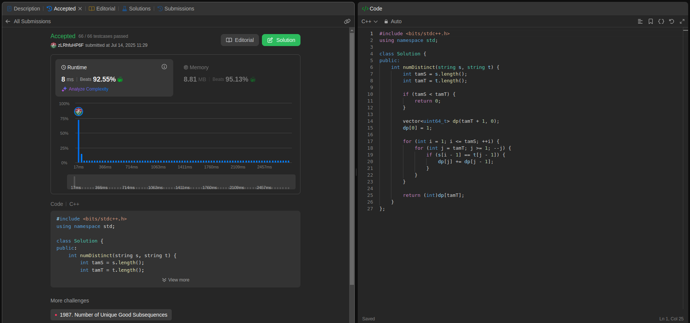
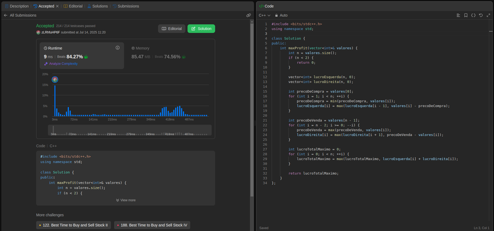
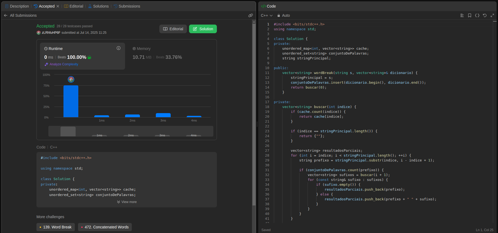

# DPLeetCode
# Exercícios LeetCode

- **Número da Lista**: 5 <br>
- **Conteúdo da Disciplina**: Dynamic Programming <br>
- [**Vídeo da Apresentação**](https://youtu.be/1LTV8UyuReY) <br>

## Alunos
|Matrícula | Aluno |GitHub|
| -- | -- | -- |
| 23/1035428  | Leonardo Henrique Sobral Sauma Junior |[leohssjr](https://github.com/leohssjr)|
| 23/1011426  | Gustavo Gontijo Lima |[Guga301104](https://github.com/guga301104)|

## Sobre 
Este repositório tem como objetivo a resolução de exercícios sobre Programação Dinâmica do [LeetCode](https://leetcode.com/), utilizando o conteúdo da disciplina Projeto de Algoritmos, sendo 3 de nível difícil. Além disso o desenvolvimento de uma aplicação utilizando o algoritmo de alinhamento genético.

## Par de Pontos Mais Próximos - Aplicação
Certifique-se de ter o `make` e `python3` instalados 

```bash
git clone https://github.com/projeto-de-algoritmos-2025/DPLeetCode.git
make run
```

Após isso, a aplicação estará disponível em ```http://localhost:8000```


**Caso queira acessar diretamente pelo deploy, basta [clicar aqui](https://projeto-de-algoritmos-2025.github.io/DPLeetCode/).**

|Exercício | Dificuldade |
| -- | -- |
|[115](https://leetcode.com/problems/distinct-subsequences/description/)|🔴 Difícil|
|[123](https://leetcode.com/problems/best-time-to-buy-and-sell-stock-iii/description/)|🔴 Difícil|
|[140](https://leetcode.com/problems/word-break-ii/description/)|🔴 Difícil|

## Screenshots

### Exercício 1 - [Distinct Subsequences](https://leetcode.com/problems/distinct-subsequences/description/)


- Dificuldade: 🔴 Difícil <br>
- Problema: [115](https://leetcode.com/problems/distinct-subsequences/description/) <br>
- [Resposta](questoes/leetcode_115.cpp) <br>

### Exerício 2 - [Best Time to Buy and Sell Stock III](https://leetcode.com/problems/best-time-to-buy-and-sell-stock-iii/description/)


- Dificuldade: 🔴 Difícil <br>
- Problema: [123](https://leetcode.com/problems/best-time-to-buy-and-sell-stock-iii/description/) <br>
- [Resposta](questoes/leetcode_123.cpp) <br>

### Exercício 3 - [Word Break II](https://leetcode.com/problems/word-break-ii/description/)


- Dificuldade: 🔴 Difícil <br>
- Problema: [140](https://leetcode.com/problems/word-break-ii/description/) <br>
- [Resposta](questoes/leetcode_140.cpp) <br>

## Instalação 
**Linguagem**: C++
- Para os testes e julgamentos automáticos, os códigos devem ser executados no LeetCode.

## Uso 
Para cada código, deve-se:
- 1: Copiar o codigo do arquivo ```*.cpp``` disponível nesse repositório.
 
- 2: Entrar no site do LeetCode para o problema da questão.

- 5: Alterar a linguagem para ```C++``` caso esteja em outra linguagem.
 
- 6: Colar o código na área destinada para a resposta.
 
- 7: Clicar em ```Run``` para testar os casos básicos.

- 8: Clicar em ```Submit``` para receber o resultado de aprovação do código.
  
## Vídeo da Apresentação
Acesse o vídeo de explicação das resoluções [clicando aqui](https://youtu.be/1LTV8UyuReY).